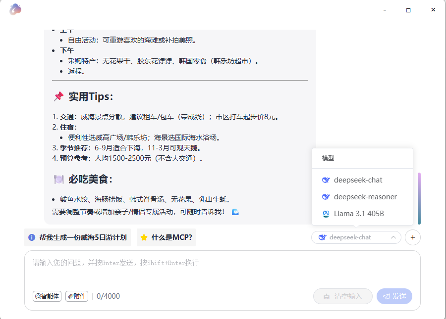

# 所用技术栈

Vue 3 + TypeScript + Vite + electron + openai + element-plus + lodash-es + deepseek

## node

node 版本 >=20.19.0

## 项目创建

```bash
npm create vite@latest electron-vue -- --template vue-ts

npm install electron electron-builder --save-dev

npm run dev

npm run build

npm run build:electron
```




## 项目结构

```bash
electron-vue
├── build
│   ├── installer.nsh
├── publish
│   ├── vite.svg
├── src
│   ├── assets
│   ├── components
│   ├── preload.ts
│   ├── renderer
│   │   ├── App.vue
│   │   ├── main.ts
│   │   ├── style.css
│   │   └── index.html
│   └── electron
│       ├── main
│       │   ├── index.ts
│       ├── preload
│       │   ├── index.ts

