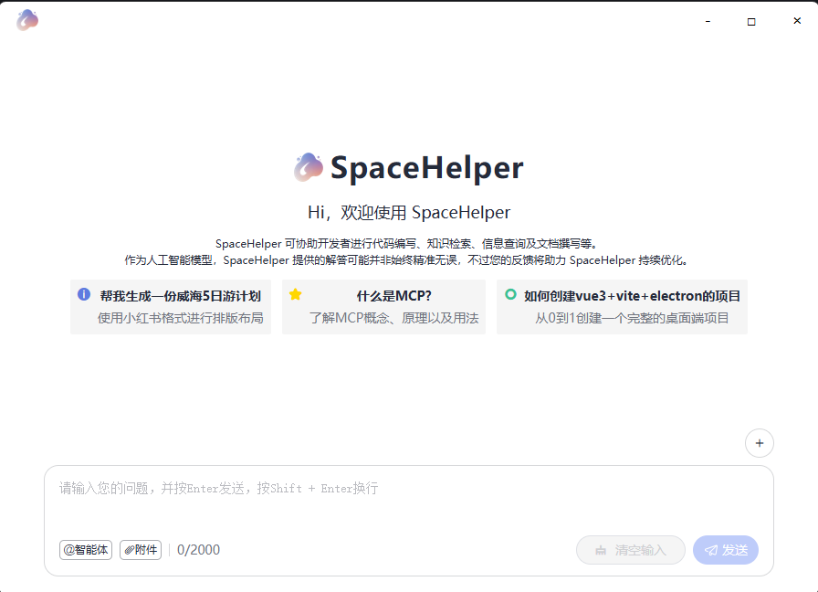
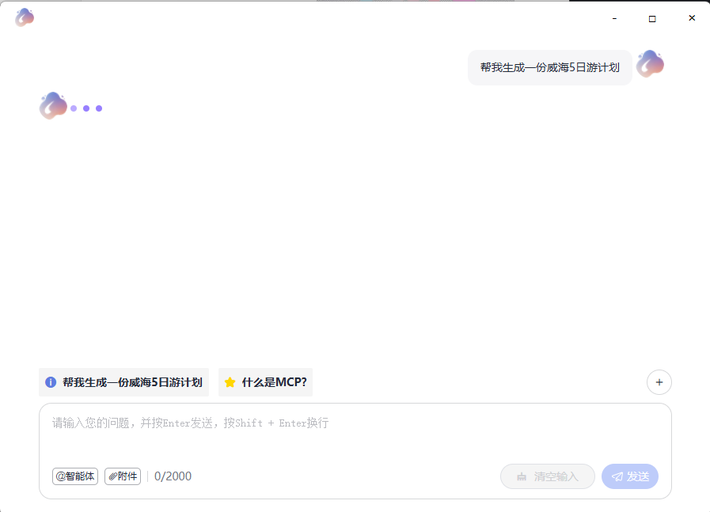
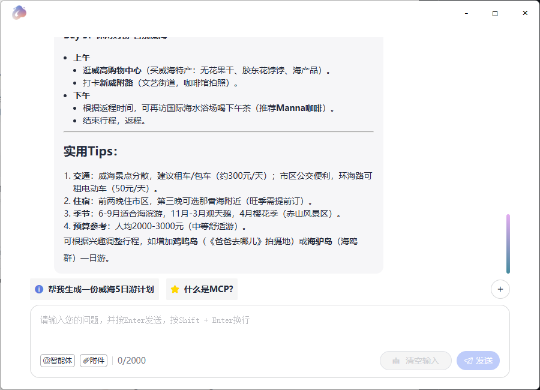

# 所用技术栈

Vue 3 + TypeScript + Vite + electron + openai + element-plus + lodash-es + deepseek

## node

node 版本 >=20.19.0

## 项目创建

```bash
npm create vite@latest electron-vue -- --template vue-ts

npm install electron electron-builder --save-dev

npm run dev

npm run build

npm run build:electron
```








## 项目结构

```bash
electron-vue
├── build
│   ├── installer.nsh       // 自定义nsis安装脚本
├── config
│   ├── index.ts            // 自定义配置
├── dist                    // 打包后的文件
├── public
│   ├── logo.png            // 应用图标
│   ├── logo.ico            // 应用图标
│   ├── icons               // 应用图标
│   ├── main                // 主进程
│   ├── preload             // 预加载
│   ├── loader.html         // 加载页面
│   ├── *.png               // 展示图片
├── src
│   ├── assets              // 静态资源
│   ├── components          // 组件
│   └── electron            // 主进程
│       ├── main
│       │   ├── index.ts
│       ├── preload
│       │   ├── index.ts
│   ├── App.vue
│   │── main.ts             
│   │── style.css
│   │── index.html


